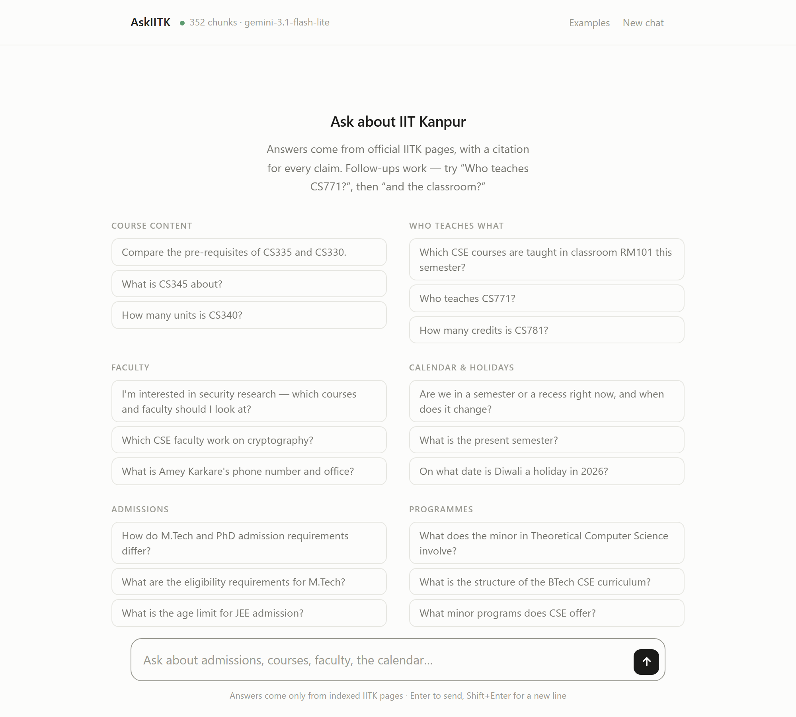
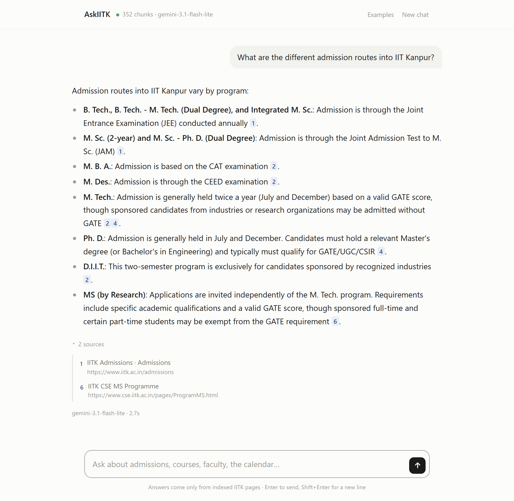
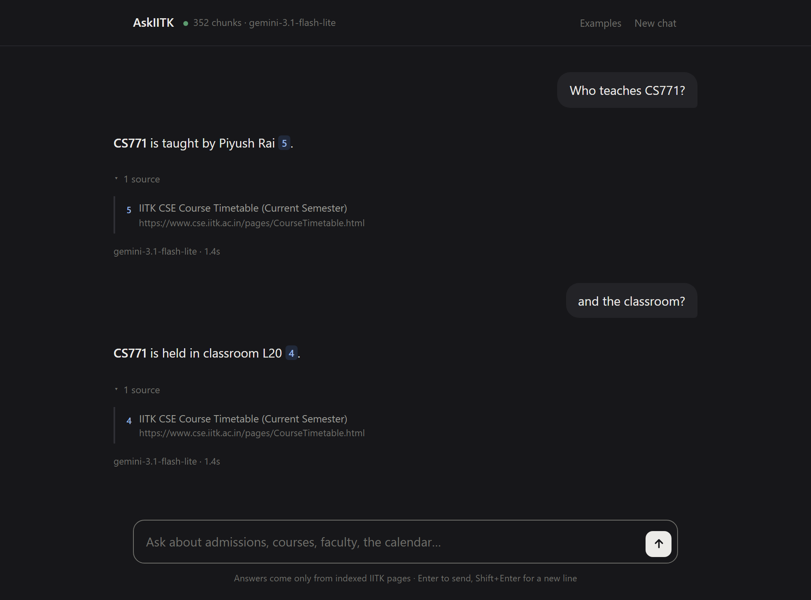
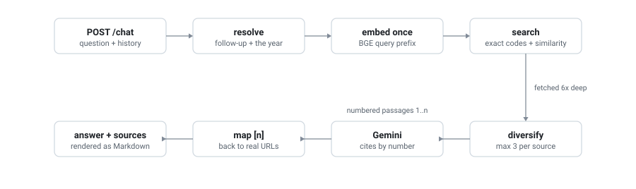

# AskIITK

Ask a question about IIT Kanpur, get an answer with a citation back to the exact
page or PDF it came from.



A language model asked about IIT Kanpur will answer confidently and sometimes
wrongly, with nothing to check it against. AskIITK answers only from a fixed set
of official IITK pages, marks every claim with a `[n]` you can click through to
the source URL, and says it does not know when those pages do not cover the
question.



Follow-ups work — the second question here names no subject, and is answered
anyway.



## How it works

Two halves that never run at the same time.

### Build — pages become a searchable index

<picture>
  <source media="(prefers-color-scheme: dark)" srcset="docs/diagrams/build-dark.svg">
  
</picture>

Only the URLs in `sources.yaml` are fetched, plus links one hop out that match a
per-source pattern — that hop is what pulls in 172 individual course pages. Pages
are split at their headings into 300–500 token chunks, each carrying the metadata
retrieval later filters and cites on, then embedded into Qdrant.

### Answering — a question becomes a cited answer

<picture>
  <source media="(prefers-color-scheme: dark)" srcset="docs/diagrams/query-dark.svg">
  
</picture>

Three things happen before the search that make the difference. A follow-up gets
the subject it omitted put back. A time-relative question gets the current year,
so "the present semester" does not match the 2025 calendar. And a named course
code is looked up by exact metadata filter, because dense embeddings cannot tell
CS345 from CS346 once 172 near-identical course pages are indexed.

After the search, `diversify` caps how many chunks any one source contributes —
course pages are 88% of the index, so without it every answer came from a course
page. The chosen passages are numbered into the prompt, and the `[n]` markers the
model returns are mapped back to real URLs; an invented number is dropped rather
than shown as a source.

## What is indexed

185 documents, 352 chunks, from 11 pinned sources in [sources.yaml](sources.yaml):
admissions, the academic calendar and holiday PDFs, the CSE department, faculty,
the course catalogue and its 172 course pages, the timetable, and the BTech /
MTech / MS / PhD / minor programme pages.

| Piece | Choice |
|---|---|
| Embeddings | BGE Small (`BAAI/bge-small-en-v1.5`, 384-dim) |
| Vector store | Qdrant — float16 vectors, indexed payload |
| LLM | Gemini (`gemini-2.5-flash` by default) |
| API + UI | FastAPI, one static HTML file |

## Run it

```bash
python -m venv .venv
.venv/Scripts/activate            # source .venv/bin/activate on Linux/macOS
pip install -r requirements.txt
cp .env.example .env              # add your GEMINI_API_KEY

python -m scripts.build_all       # crawl -> chunk -> embed -> index
uvicorn api.main:app --port 8000  # -> http://localhost:8000/ui
```

A Gemini key is needed only to generate answers; crawling, chunking and retrieval
work without one. `POST /chat` takes `{question, history}` and returns
`{answer, sources}`; `POST /retrieve` does retrieval with no LLM call.

Or in Docker, with the model and index baked into the image:

```bash
docker compose up --build
```
