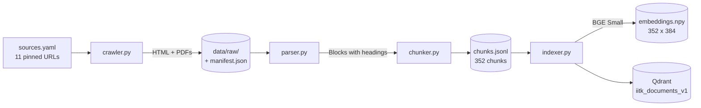
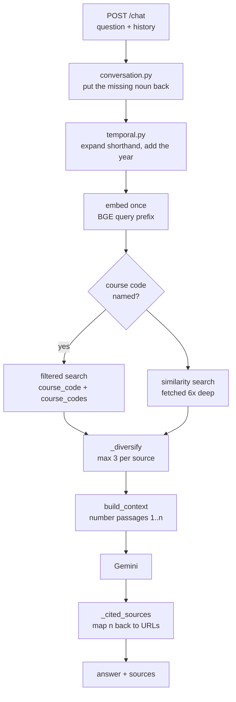

# AskIITK

Ask a question about IIT Kanpur, get an answer with a citation back to the exact
page or PDF it came from.


The point is not that it answers — anything answers. The point is that every claim
carries a `[n]` marker you can click, and behind it is a real IITK URL. When the
indexed pages do not contain the answer, it says so instead of inventing one.


Follow-ups work. "Who teaches CS771?" then "and the classroom?" — the second
question names no subject, and is answered anyway.


---

## How it works, end to end

Two halves that never run at the same time: an **offline build** that turns web
pages into a searchable index, and an **online query path** that answers one
question. Every step below is a real module you can open.

### Build: pages → chunks → vectors



**1. Crawl** — [`ingestion/crawler.py`](ingestion/crawler.py)

Fetches exactly the URLs in [`sources.yaml`](sources.yaml). Not a crawler in the
usual sense: it follows links one hop only, on the same host, only when they match
that source's `link_pattern`, and only up to `max_links`. That single hop is what
pulls in the 172 individual course pages behind the catalogue. Everything lands in
`data/raw/` with a manifest recording each document's URL, crawl time and SHA256.

**2. Parse** — [`ingestion/parser.py`](ingestion/parser.py)

HTML is walked into `Block`s, opening a new section at every `h1`–`h3` so each
block knows the heading it sits under. Navigation menus are dropped. Table rows are
emitted whole — `CS330 | Operating Systems` — because splitting a row cuts a course
code away from its name. PDFs have no headings to walk, so headings are inferred
from font size against the page's modal body size; if fewer than two turn up, the
parser reports that and the chunker falls back to fixed windows.

**3. Chunk** — [`ingestion/chunker.py`](ingestion/chunker.py)

Blocks become 300–500 token chunks with 60 tokens of overlap, each prefixed with
its page title and heading trail — which improves retrieval *and* leaves the model
enough context to cite correctly. The metadata attached here is what retrieval
later filters and cites on: `source_id`, `url`, `page`, `heading`, `course_code`
(the page's own course) and `course_codes` (every code the chunk mentions).

**4. Embed and index** — [`ingestion/indexer.py`](ingestion/indexer.py)

Each chunk is embedded with BGE Small into 384 dimensions and upserted into Qdrant
with a deterministic UUID5 id, so re-indexing updates a point rather than
duplicating it. Vectors are cached in `embeddings.npy`, keyed to a fingerprint of
the chunk set, so re-indexing unchanged chunks re-embeds nothing.

### Query: question → answer with citations



**1. Resolve the follow-up** — [`rag/conversation.py`](rag/conversation.py)

"and the classroom?" embeds to nothing useful. If a question carries a pronoun,
opens with a fragment like "and…", or runs under five words, the previous user
turns are prepended to the *embedding* query. Deliberately a heuristic rather than
a condense-question LLM call, which would double the request count on a free tier
capped at 15 requests a minute. The raw turns still go to the model, which is what
resolves the reference in the prose.

**2. Ground it in time** — [`rag/temporal.py`](rag/temporal.py)

"What is the present semester?" carries no year, so it matches the 2025 calendar as
readily as the 2026 one. Time-relative questions get the current year appended
before embedding, and campus shorthand (`sem`, `dept`, `prof`) is expanded. The
prompt is told today's date — but *which* semester that is has to come from the
calendar document, or the answer goes stale the moment the calendar changes.

**3. Embed once** — [`rag/embeddings.py`](rag/embeddings.py)

BGE wants an instruction prefix on the query side only. The vector is computed once
and reused by every search below; a question naming two course codes issues five
searches against the same vector.

**4. Exact lookup for course codes** — [`rag/course_codes.py`](rag/course_codes.py)

Dense embeddings are bad at identifiers. With 172 near-identical course pages
indexed, "the pre-requisites for CS345" matches the *shape* of a course page, and
CS346 scores about as well as CS345. So a named code gets a metadata filter
instead: one pass on `course_code` for the course's own page, another on
`course_codes` for the timetable row and catalogue line that merely mention it.

**5. Search, then rebalance** — [`rag/pipeline.py`](rag/pipeline.py)

Course pages are 88% of the index, so a plain top-k returns nothing else — the
faculty chunk answering "Sunil Simon's designation" sat at rank 13. `_diversify`
fetches six times deeper than needed and admits at most three chunks from any one
source, keeping the overflow as backfill so a genuinely single-source question
still fills its context.

**6. Prompt and cite** — [`rag/prompts.py`](rag/prompts.py)

Passages enter the prompt numbered `[1]`, `[2]`, … and the model is told to cite
those numbers inline and answer from nothing else. The reply is parsed back: each
`[n]` maps to the passage it came from, and a number outside the range is dropped
rather than rendered as a source. That mapping is why a fabricated citation is
visible immediately instead of merely plausible.

**7. Render** — [`api/static/index.html`](api/static/index.html)

One static file. The answer arrives as Markdown and is HTML-escaped *first*, then
parsed into real blocks — so bold labels, bullets and tables render, and nothing
the model emits can reach the DOM as markup. Clicking a `[n]` chip scrolls to the
source backing it.

---

## Stack

| Piece | Choice |
|---|---|
| Embeddings | BGE Small (`BAAI/bge-small-en-v1.5`, 384-dim) |
| Vector store | Qdrant — collection `iitk_documents_v1`, float16 vectors, indexed payload |
| LLM | Gemini (`gemini-2.5-flash` by default) |
| Framework | LlamaIndex — embedding and LLM wrappers only; Qdrant is talked to directly |
| API | FastAPI |
| Container | one self-contained image; `docker compose up` |

## Sources

Defined in [sources.yaml](sources.yaml). No open-ended crawling — only these URLs,
plus the PDFs and course pages they link that match each source's filter.

| Source | URL |
|---|---|
| Admissions | https://www.iitk.ac.in/new/admissions |
| Academic Calendar (DOAA) | https://www.iitk.ac.in/doaa/academic-calendar |
| CSE Department | https://www.cse.iitk.ac.in/ |
| CSE Faculty | https://www.cse.iitk.ac.in/pages/Faculty.html |
| CSE Courses Offered | https://www.cse.iitk.ac.in/pages/Courses.html (+172 linked course pages) |
| CSE Course Timetable | https://www.cse.iitk.ac.in/pages/CourseTimetable.html |
| CSE BTech / MTech / MS / PhD | `pages/Program*.html` |
| CSE Minor Programmes | https://www.cse.iitk.ac.in/pages/MinorPrograms.html |

The calendar source also pulls 4 linked PDFs — the 2025 and 2026 calendars, the
2026 holiday list, and the eMasters calendar.

Department tagging is a manual `source → department` mapping in `sources.yaml`. At
this size, auto-extraction would be more machinery than the problem needs.

### What ends up in the index

185 documents, 352 chunks: 181 HTML pages and 4 PDFs.

| Source | Chunks | Answers questions about |
|---|---|---|
| `cse_courses` | 309 | course contents, pre-requisites, units — one page per course |
| `academic_calendar` | 12 | semester dates, holidays, exams (all from PDFs) |
| `cse_department` | 7 | department history, news, awards |
| `admissions` | 4 | entrance exams, eligibility, age limits |
| `cse_faculty` | 4 | who works on what, phone, office, email format |
| `cse_timetable` | 3 | instructors, timings, classrooms, credits |
| `cse_btech` / `mtech` / `ms` / `phd` / `minors` | 13 | programme structure, requirements |

That 88% concentration in `cse_courses` is the single fact that shaped
retrieval — see step 5 above.

## Setup

```bash
python -m venv .venv
.venv/Scripts/activate          # Windows;  source .venv/bin/activate on Linux/macOS
pip install -r requirements.txt

cp .env.example .env            # then add your GEMINI_API_KEY
```

Get a Gemini key at https://aistudio.google.com/apikey. Crawl, chunk, embed and
retrieve all work without one — only answer generation needs it.

## Build the index

```bash
python -m scripts.build_all
```

Each stage also runs on its own:

```bash
python -m ingestion.crawler     # fetch HTML + linked PDFs -> data/raw/
python -m ingestion.chunker     # parse + chunk            -> data/chunks/chunks.jsonl
python -m ingestion.indexer     # embed + push to Qdrant
```

`--recreate` drops the collection first; `--no-cache` forces a re-embed.

## Run the API

```bash
uvicorn api.main:app --reload --port 8000
```

Then open **http://localhost:8000/ui**. The thread survives a page reload via
`localStorage`; "New chat" clears it.

```bash
curl -s -X POST http://localhost:8000/chat \
  -H "Content-Type: application/json" \
  -d '{"question": "When does the odd semester begin in the 2026 academic calendar?"}'
```

```json
{
  "answer": "... [1]",
  "sources": [
    {
      "citation": 1,
      "source_name": "IITK Academic Calendar (DOAA)",
      "department": "Academic Affairs (DOAA)",
      "url": "https://www.iitk.ac.in/doaa/data/Calendar-2026.pdf",
      "page": 1,
      "heading": "Academic Calendar 2026-27",
      "score": 0.71
    }
  ],
  "latency_ms": 2140,
  "model": "gemini-2.5-flash"
}
```

| Endpoint | Does |
|---|---|
| `POST /chat` | question + history → answer + cited sources |
| `POST /retrieve` | retrieval only, no LLM call — what the eval script scores |
| `GET /health` | index size, whether generation is enabled |
| `GET /ui` | the chat page (`/` redirects here) |
| `GET /docs` | Swagger |

## Evaluation

39 hand-verified questions in [tests/eval_questions.yaml](tests/eval_questions.yaml),
covering all eleven sources.

```bash
python -m tests.run_eval              # retrieval only — no API key needed
python -m tests.run_eval --generate   # full answers through Gemini
```

It scores the two mechanical things — was the right source retrieved, and was it
cited — and writes `data/processed/eval_run.json` with `answer_correct: null` per
row for you to fill in. Answer quality is graded by hand on purpose.

Last run: **retrieval@6 39/39, top-1 source 32/39**. Retrieval@6 only says the
right source appeared somewhere in the top 6 — it is a floor, not a score.

```bash
pytest -q      # 45 unit tests
```

## How the index is stored

`ensure_collection` in [rag/vector_store.py](rag/vector_store.py) creates the
collection explicitly rather than letting it appear on first write, which is what
makes these possible:

- **float16 vectors.** BGE normalises into roughly ±0.2, where float16 still
  carries more precision than cosine ranking can use. Half the bytes, and the eval
  set does not shift.
- **A payload of only what a query reads** — prompt text, the fields an answer
  cites, and the two filter keys. Build-time diagnostics (`sha256`,
  `chunk_strategy`, `n_tokens`) stay in `chunks.jsonl`, which is the record of what
  was indexed.
- **Payload indexes** on `course_code`, `course_codes`, `source_id` and `doc_type`.
  The course-code filters are why naming a course retrieves that course, so they
  should not be a full scan as the corpus grows. Server mode only — the embedded
  client scans regardless.

Points go through `qdrant-client` directly. LlamaIndex's vector store wrote a
`_node_content` blob holding a second copy of the text and every metadata field —
41% of the payload — and created the collection implicitly, leaving nowhere to
declare an index.

`embeddings.npy` is float32, not the float64 numpy picks for lists of Python
floats. An older float64 cache is rewritten in place rather than re-embedded.

### local vs server

`QDRANT_MODE` in `.env` decides:

- **`local`** (default) — embedded on-disk Qdrant under `data/qdrant_local/`. No
  Docker needed. One process at a time may hold the directory, so stop the API
  before re-indexing. Payload indexes are a no-op here and are skipped.
- **`server`** — a Qdrant container. Nothing else in the code changes:

  ```bash
  docker compose -f docker-compose.yml -f docker-compose.server.yml up -d qdrant
  ```

  Then set `QDRANT_MODE=server` and re-run `python -m ingestion.indexer`.

## Deployment

One self-contained image. Both slow things are baked in at build time, so the
running container needs no sidecar, no volume and no network at startup:

- **BGE Small** → `/models`, with `HF_HUB_OFFLINE=1` at runtime so it can never
  reach out for a model file
- **the Qdrant index** → `/app/data/qdrant_local`, embedded mode

The index is rebuilt inside the builder stage from `data/chunks/`, but
`embeddings.npy` is a fingerprint-keyed cache, so that step copies rather than
re-embeds. **The image is the index**: when sources change, re-run the ingestion
locally and rebuild.

```bash
python -m scripts.build_all --recreate   # crawl -> chunk -> embed -> index
docker compose build                     # bakes the refreshed chunks into the image
```

torch is installed from PyTorch's CPU index. Resolved from PyPI it pulls the CUDA
build and its `nvidia-*` wheels — several GB of GPU runtime for an image that only
ever runs BGE Small on one vCPU.

`data/chunks/` is committed for the same build: it is the one part of `data/` the
build context needs, and without it a fresh clone has nothing to index.

### Local run

```bash
docker compose up --build           # -> http://localhost:8000/ui
```

`GEMINI_API_KEY` comes from `.env` at runtime and is never baked into the image.
Without a key the app still starts and `/health` and `/retrieve` work; only `/chat`
needs Gemini, and it returns 503 without one.

### Against a Qdrant server

The overlay swaps the baked-in index for a real Qdrant with a persistent volume,
which is what you want while iterating on the corpus.

```bash
docker compose -f docker-compose.yml -f docker-compose.server.yml up -d --build
docker compose -f docker-compose.yml -f docker-compose.server.yml run --rm indexer
```

`indexer` is a one-shot service built from the Dockerfile's `builder` stage — the
only stage carrying `ingestion/` and `data/chunks/`. `down -v` drops the volume and
the collection with it.

### Azure

```powershell
az login
.\deploy\azure.ps1 -Tag v4
```

Builds, pushes to Docker Hub, and updates the Container App in place. Bump the tag
each time — Container Apps will not reliably pick up a re-pushed identical tag.

| Setting | Value | Why |
|---|---|---|
| CPU / memory | 1.0 / 2.0Gi | torch + BGE Small resident |
| replicas | 0–2 | scale to zero; idle costs nothing |
| ingress | external, port 8000 | HTTPS and a public FQDN come free |
| `GEMINI_API_KEY` | Container Apps secret | never in the image — `.dockerignore` excludes `.env` |

The app shares an existing Container Apps environment rather than creating its own,
and uses a public Docker Hub image rather than an ACR, so nothing bills between
deploys. At zero replicas the first request after an idle period pays a ~30s cold
start while torch and the model load; `-MinReplicas 1` keeps one warm.

```powershell
az containerapp logs show -n iitk-rag -g iitk-rag-rg --follow
az group delete -n iitk-rag-rg --yes --no-wait   # tear it all down
```

The Azure and Docker Hub identifiers are `iitk-rag`, from before the project was
named AskIITK. Neither can be renamed in place, and both only ever appear in a
hostname, so they stay as they are.

## Layout

```
sources.yaml            the source list + department mapping
ingestion/
  crawler.py            fetch HTML, discover + download linked PDFs
  parser.py             HTML heading walk; PDF font-size heading detection
  chunker.py            token windowing with overlap -> chunks.jsonl
  indexer.py            BGE Small embeddings -> Qdrant
rag/
  config.py             settings, paths, source loading
  embeddings.py         BGE Small, with the query-side instruction prefix
  vector_store.py       Qdrant client, collection schema, search
  prompts.py            the answer prompt and citation contract
  temporal.py           today's date + query expansion for "current"/"present"
  conversation.py       follow-up resolution for the chat UI
  course_codes.py       course-code extraction for exact lookup
  pipeline.py           retrieve -> generate
api/main.py             POST /chat, /retrieve, /health, GET /ui
api/static/index.html   chat UI served at /ui
tests/
  eval_questions.yaml   39 hand-verified questions
  run_eval.py           scoring harness
  test_ingestion.py     parsing + chunking
  test_pipeline.py      context assembly + citation mapping
  test_temporal.py      date grounding
  test_conversation.py  follow-up resolution
scripts/build_all.py    crawl -> chunk -> embed -> index in one command
Dockerfile              two-stage: bake the model + index, then a slim runtime
docker-compose.yml      the self-contained image, one command
docker-compose.server.yml  overlay: app + a real Qdrant + a one-shot indexer
deploy/azure.ps1        build, push, deploy to Azure Container Apps
docs/screenshots/       the images in this README
data/                   raw/, processed/, qdrant_local/ gitignored; chunks/ committed
```

## Known gaps

Measured, not guessed — a batch of 18 realistic questions leaves 8 unanswered:

- **Institute-wide topics are not indexed**: fees, hostels, placements
  (`spo.iitk.ac.in`), campus location, convocation. These live on separate
  subdomains; pulling them in means widening `sources.yaml`, not changing code.
- **Course prerequisites** are not published on any page currently indexed.
- **Counting questions fail** ("how many faculty are there?"). The roster spans
  four chunks and top-k retrieval only ever sees some of them, so the model cannot
  count. Structural to RAG, not a corpus gap — it needs an aggregate query path,
  not more documents.

## Design notes

**Heading text is prepended to every chunk.** A chunk reading "Semester fee is ₹X"
is useless alone; "Academic Calendar 2026 — Fee Structure: Semester fee is ₹X"
retrieves better *and* gives the model the context to cite correctly.

**BGE needs an asymmetric prefix.** Queries get
`"Represent this sentence for searching relevant passages: "`, passages get
nothing. Set once in `rag/embeddings.py` — applying it to both sides, or neither,
quietly degrades retrieval.

**Course codes are looked up exactly, not semantically.** The single change that
made "Who teaches CS771?" work again after the course pages went in.

**No single source may flood the results.** `_diversify` is a cheap stand-in for a
reranker: it fixes *which* sources appear, not the ordering within a source, which
is why top-1 sits at 82%.

**Table rows stay whole.** A `<tr>` is emitted as one unit — `CS335 | Compiler
Design` — because splitting a row scatters a record across chunk boundaries and
severs the code from its name.

**PDF chunking degrades gracefully.** Headings come from font size against the
modal body size; under two headings, the chunker falls back to fixed 400-token
windows and records which strategy it used per chunk.

**Citations are verified, not trusted.** The pipeline parses `[n]` out of the
answer and maps it back to real URLs. A number outside the range is dropped rather
than rendered.

**Rate limits are a condition, not a bug.** Gemini's free tier allows 15 requests a
minute, so a 429 comes back as a 429 with `Retry-After` rather than a 500.

## Not built

No agent framework, no router, no query planner, no hybrid or sparse search, no
reranker, no GraphRAG, no live sync. At 352 chunks none of it earns its place — the
measured failures were all in chunking, exact-match retrieval and result diversity,
and were fixed there.
